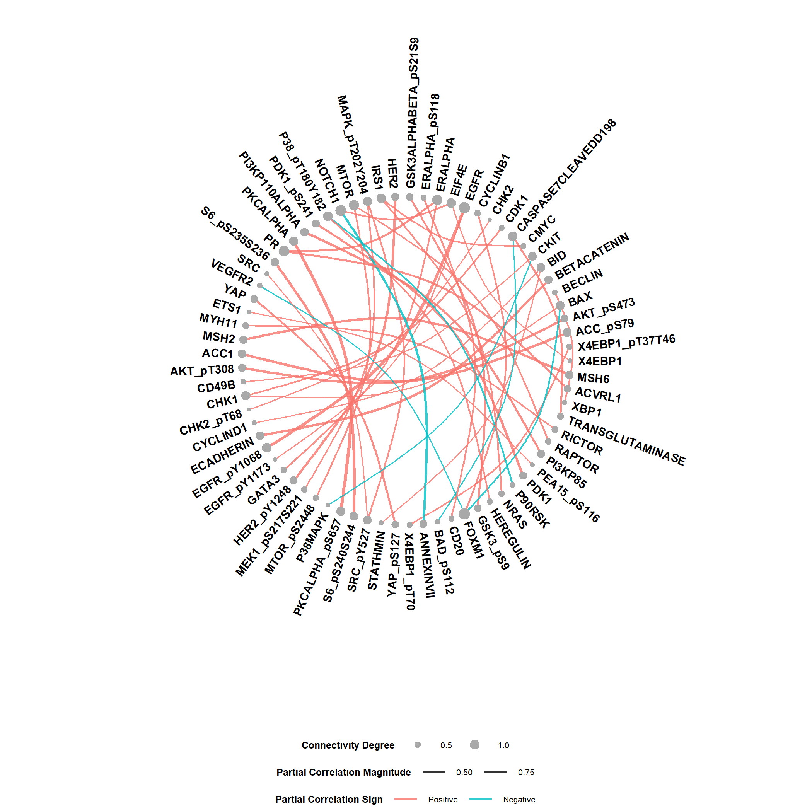

<!-- README.md is generated from README.Rmd. Please edit that file -->

# GraphR overview

<center>

</center>

The GraphR (Graphical Regression) is a flexible approach which
incorporates sample heterogenity and enables covariate-dependent graphs.
Our regression-based method provides a functional mapping from the
covariate space to precision matrix for different types of heterogeneous
graphical model settings. GraphR imposes sparsity in both edge and
covariate selection and computationally efficient via use of variational
Bayes algorithms. The method is versatile to incorporate different type
of covariates such as <br> (I) **binary** (control and disease specific
graphs), <br> (II) **categorical** (category specific graphs such as
cancer subtypes), <br> (III) **univariate continuous** (time varying
graphs for single cell data), <br> (IV) **categorical + univariate
continuous** (graphs changing over category such as cancer sub-types and
continuous scale as biomarkers), <br> (V) **multivariate continuous**
(spatial transcriptomics co-expression networks). <br> GraphR is
implemented as an open-source R package and Shiny app.

## Installation

You can install the released version of GraphR from
(<https://github.com/bayesrx/GraphR>) with:

``` r
devtools::install_github("bayesrx/GraphR")
library(GraphR)
```

## Functions

### GraphR_est() function

The **GraphR_est()** function can be used to estimate the graphical
regression coefficients and inclusion probabilities of external
covariates for the GraphR models. It is suggested to maintain $n/pq >1$
and efficacy of the method increase with high values of $n/pq$ ratio.
For priors, we assume $\pi \sim Beta(a_\pi, b_\pi)$ and
$\tau \sim \Gamma(a_\tau, b_\tau)$.

The **mandatory inputs** of estimation function are given below.

- **Features (nodes)**: Nodes of the graphs among which edges are built
  (e.g. a gene expression matrix of dimensions $n \times p$). **Please
  standardize features before plugging into the function or set
  standardize_feature = TRUE in the function**.

- **Cont_external and dis_external (continuous and discrete external
  covariates)**: An $n \times q_1$ and an $n \times q_2$ matrices of
  continuous and discrete external covariates respectively.
  $q_1 + q_2 =q$. **Please standardize continuous external covariates
  before plug into the estimation function or set standardize_external =
  TRUE in the function.**

The **optional inputs** of estimation function are given below.

- **$\boldsymbol a_{\boldsymbol \pi}$,
  $\boldsymbol b_{\boldsymbol \pi}$**: Hyper-parameters from
  $\pi \sim Beta(a_\pi, b_\pi)$. By default $a_\pi = 1, b_\pi = 4$.

- **$\boldsymbol a_{\boldsymbol \tau}$,
  $\boldsymbol b_{\boldsymbol \tau}$**: Hyper-parameters from
  $\tau \sim Gamma(a_\tau, b_\tau)$. By default
  $a_\tau = 0.005, b_\tau = 0.005$.

- **Standardize_feature, standardize_external**: Standardize features or
  continuous external covariates. Default as FALSE.

- **Max_iter**: Maximum number of iterations. Default as 2,000.

- **Max_tol**: Maximum tolerance. Default as 0.001.

**Outputs** of the **GraphR_est()** function are provided below.

- **Beta (the graphical regression coefficients)**: A
  $p \times p \times q$ array of coefficients for external covariates.
  The $[i,j,k]$ element represents the effect of k-th external
  covariates on regression of j-th node on i-th node.

- **Phi (posterior inclusion probability)**: A $p \times p \times q$
  array storing posterior inclusion probability (PIP) of external
  covariates. The elements represents the PIP of k-th external
  covariates on regression of j-th node on i-th node.

- **Omega_diag (diagonal elements of precision matrix)**: A p vector
  with i-th element representing the inverse variance of error.

### GraphR_pred() function

The **GraphR_pred()** function can be used to predict partial
correlation between two nodes and the corresponding inclusion
probabilities from the results of GraphR model alongwith Bayesian
FDR-adjusted p-values.

The **mandatory inputs** of prediction function are given below.

- **New_df**: A matrix of new external covariates based on which
  predictions are made. **Note: Please ensure that the order and scale
  of new external covariates are same as those used in the estimation.**

The **optional inputs** of prediction function are given below.

- **GraphR_est_res**: Results from `GraphR_est` function. If
  graphR_est_res = NULL, then the following three inputs: (1) beta; (2)
  phi; (3) omega_diag are needed.

- **Beta**: A $p \times p \times q$ array storing coefficients of
  external covariates. The $[i,j,k]$ elements represents the effect of
  k-th external covariates on regression of j-th node on i-th node.

- **Omega_diag**: A p vector with i-th element representing the inverse
  variance of error.

- **Pip**: A $p \times p \times q$ array storing posterior inclusion
  probability (PIP) of external covariates. The $[i,j,k]$ elements
  represents the PIP of k-th external covariates on regression of j-th
  node on i-th node.

The **output** contains following information.

- **Feature_id1**, **feature_id2**: Indices of features or nodes.

- **Pr_inclusion**: Posterior inclusion probability of connections
  between two nodes based on “And” rules.

- **Correlation**: Partial correlation between two nodes. Values with
  maximum magnitudes are provided.

- **FDR_p**: Bayesian FDR-adjusted p values.

### GraphR_visualization() function

The **GraphR_visualization()** function provides a circular network
based on a given new external covariates vector and thresholds for FDR-p
values and magnitudes of partial correlations.

The **mandatory inputs** of prediction function are given below.

- **New_vec**: A vector of new external covariates based on which plot
  is made. **Note: Please ensure that the order and scale of new
  external covariates are same as those used in the estimation.**

The **optional inputs** of prediction function are given below.

- **GraphR_est_res**: Results from `GraphR_est` function. If
  graphR_est_res = NULL, then the following three inputs: (1) beta; (2)
  phi; (3) omega_diag are needed.

- **Beta**: A $p \times p \times q$ array storing coefficients of
  external covariates. The $[i,j,k]$ elements represents the effect of
  k-th external covariates on regression of j-th node on i-th node.

- **Omega_diag**: A p vector with i-th element representing the inverse
  variance of error.

- **Pip**: A $p \times p \times q$ array storing posterior inclusion
  probability (PIP) of external covariates. The $[i,j,k]$ elements
  represents the PIP of k-th external covariates on regression of j-th
  node on i-th node.

- **Fdr_thre**: A numeric value. Threshold for Bayesian FDR adjusted
  q-values.

- **Magnitude_thre**: A numeric value. Threshold for the magnitude of
  partial correlations.

The **output** provides a circular network plot. Node sizes represent
connectivity degrees of the corresponding features while edge widths are
proportional to the partial correlation between two features. Sign of
the partial correlations are represented by the color

## Example

An example code with one of the existing datasets to demonstrate how to
run the functions and obtain inference.

``` r
set.seed(100)
library(GraphR)
data("Pam50")

features <- as.matrix(apply(Pam50$features,2,scale)) 
features[c(1:5),c(1:5)]
#>      X1433EPSILON     X4EBP1 X4EBP1_pS65 X4EBP1_pT37T46    X53BP1
#> [1,]   -0.9298711 -1.0325344  -0.1814837      0.3870419 -1.125110
#> [2,]   -1.2265417 -0.8121828  -0.9249897     -0.4834352  1.084052
#> [3,]   -0.9250730 -0.1882466   0.8258123     -0.4022269  0.289943
#> [4,]   -0.6566337 -0.2473042   0.2114522      0.9897723  2.134105
#> [5,]   -0.9476849  1.7654120   2.7128204      2.1739453  1.378139

external <- as.matrix(Pam50$external)
external[c(1:5),]
#>      basal_like her2_enriched luminal_ab
#> [1,]          0             1          0
#> [2,]          0             0          1
#> [3,]          0             0          1
#> [4,]          0             0          1
#> [5,]          0             0          1


system.time(res <- GraphR_est(
  features,
  external,
  a_pi = 1,
  b_pi = 4,
  a_tau = 0.005,
  b_tau = 0.005,
  max_iter = 2000,
  max_tol = 0.001
))
#>    user  system elapsed 
#>  238.57   87.30  328.24

####### prediction
new_df <- diag(3)
colnames(new_df) <- colnames(external)

system.time(pred <- GraphR_pred(new_df, res))
#>    user  system elapsed 
#>    8.66    0.07    8.73
head(pred)
#>   basal_like her2_enriched luminal_ab     feature1       feature2 Pr_inclusion
#> 1          1             0          0     PKCALPHA PKCALPHA_pS657            1
#> 2          1             0          0      ERALPHA             PR            1
#> 3          1             0          0 S6_pS235S236   S6_pS240S244            1
#> 4          1             0          0          BID       STATHMIN            1
#> 5          1             0          0          YAP      YAP_pS127            1
#> 6          1             0          0        RAD51    X4EBP1_pT70            1
#>   Correlation FDR_p
#> 1   0.7938597     0
#> 2   0.4530799     0
#> 3   0.8136693     0
#> 4   0.4157183     0
#> 5   0.7698744     0
#> 6   0.3773436     0

####### visualization
new_vec <- c(1,0,0)
GraphR_visualization(new_vec, graphR_est_res = res,
                     fdr_thre = 0.01, magnitude_thre = 0.4)
#> Joining with `by = join_by(feature)`
```



## Shiny App

(link to the Shiny App tab only)

## Tutorial website

(link to the tutorial website)

## Paper

(Link to the paper)

## Supplementary file

[Supplementary](https://bookdown.org/bayesrx/graphr_supplementary/)
